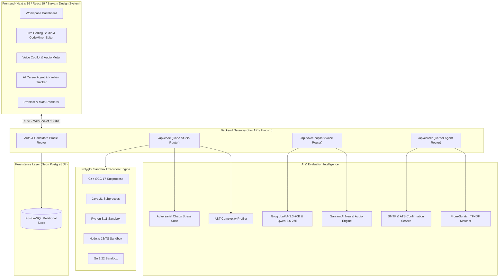
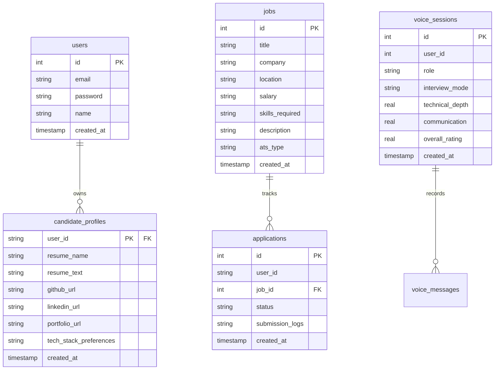

# PrepAI: AI-Powered Technical Interview Simulator, Live Coding Studio & Career Co-Pilot

<p align="left">
  <a href="https://nextjs.org/"></a>
  <a href="https://fastapi.tiangolo.com/"></a>
  <a href="https://www.python.org/"></a>
  <a href="https://react.dev/"></a>
  <a href="https://gcc.gnu.org/"></a>
  <a href="https://www.oracle.com/java/"></a>
  <a href="https://nodejs.org/"></a>
  <a href="https://golang.org/"></a>
  <a href="https://sarvam.ai/"></a>
  <a href="LICENSE"></a>
</p>

PrepAI is an enterprise-grade technical interview simulation, live polyglot coding studio, and career acceleration platform. The system bridges the gap between practice and real-world hiring by combining:
1. **Interactive Live Coding Studio & Polyglot Sandbox**: Native subprocess sandbox executing C++ (GCC 17), Java (OpenJDK 21), Python 3.11, JavaScript/TypeScript (Node.js), and Go with deterministic test runners, AST complexity analysis, and adversarial stress testing.
2. **AI Voice Copilot & Technical Interviewer**: Stateful real-time audio mock interviews powered by Sarvam AI neural speech synthesis (bulbul:v3), STT (saaras:v3), and LLaMA-3.3-70B conversational agents across junior to staff/bar-raiser personas.
3. **AI Career Agent & ATS Confirmation Engine**: Automated job discovery crawler, TF-IDF resume skill-matching engine, high-precision candidate entity extraction, and verified email application receipts.

---

## 🏛️ Platform Architecture

PrepAI is structured as a decoupled full-stack architecture coordinated by a FastAPI backend running on Render and a Next.js 16 single-page web app running on Vercel.



---

## 💻 1. Live Coding Studio & Polyglot Sandbox Engine

The **Live Coding Studio** provides an authentic IDE environment for DSA problems, real-world backend architectures, and live bug-hunting scenarios.


### Key Capabilities

1. **Isolated Polyglot Execution Runners (`backend/code_studio/runner.py`)**:
   - **Python 3.11**: Isolated tempfile harness capturing exact stdout, stderr, return values, execution timings, and tracebacks.
   - **C++ (GCC 17)**: Direct `g++` compilation (`-O2 -std=c++17`) with recursive test case array/vector serialization and nanosecond timing.
   - **Java (OpenJDK 21)**: Compiles `Solution.java` with test harness wrappers supporting multidimensional arrays, lists, and custom classes.
   - **JavaScript / TypeScript (Node.js)**: Runs in isolated Node execution contexts with deep equality object evaluation.
   - **Go (Golang 1.22)**: Compiles and executes Go test harnesses with concurrency and pointer verification.

2. **Function Stubs & Skeletons vs Reference Solutions (`backend/code_studio/catalog.py`)**:
   - Candidates start with clean function stubs (e.g. `def climbStairs(n: int) -> int: pass` or `// Write your code here`) requiring genuine implementation to pass test suites.
   - Reference solutions are preserved in `reference_solution` for automated scoring and Socratic guidance.

3. **Adversarial Chaos Stress Engine (`backend/code_studio/chaos.py`)**:
   - Automatically subjects candidate code to extreme production edge cases:
     - **Scale Explosions**: $N=10^5$ memory and algorithmic time traps.
     - **Monotonic Bursts**: Strict ascending/descending inputs testing pivot selection and balance invariants.
     - **Boundary Zeros & Negatives**: Cross-zero cancellation and integer overflow boundaries.
     - **Jagged Canyons**: Unequal nested distributions and memory exhaustion checks.
   - Returns an adversarial resilience percentage score and vulnerability diagnosis.

4. **AST Complexity Radar (`backend/code_studio/analyzer.py`)**:
   - Runs native AST parsing on candidate source code to extract loop depth, recursive calls, branch complexity, and space allocations.
   - Uses Groq LLM profiling to deliver verified Big-O Time and Space ratings with actionable optimization tips.

5. **Clean Markdown & Mathematical Typography ([`ProblemRenderer.jsx`](frontend/components/coding/ProblemRenderer.jsx))**:
   - Renders problem constraints, inline code chips (`bg-[#FAF6F0] text-[#C85A32] border border-[#DFD5C6]`), mathematical formulas ($O(1)$, $N=10^5$), and geometric terracotta bullet lists.

---

## 🎙️ 2. AI Voice Copilot & Real-Time Technical Interviewer

The Voice Copilot conducts stateful, conversational technical mock interviews with human-grade audio latency.


1. **Sarvam Neural Voice Integration**:
   - **Speech-to-Text (STT)**: Transcribes verbal candidate answers via Sarvam saaras:v3 or Groq Whisper-large-v3, optimized for Indian accents and technical vocabulary.
   - **Text-to-Speech (TTS)**: Synthesizes conversational interviewer speech using Sarvam bulbul:v3.
2. **Dynamic Audio Visualizer**:
   - Real-time audio waveform meter and instant microphone speech recognition.
3. **Seniority Interviewer Personas**:
   - **Junior Engineer**: Guided syntax, helpful Socratic feedback.
   - **Mid-Level Engineer**: Emphasizes testing patterns, modular API contracts, and clean code.
   - **Senior Engineer**: Explores caching policies, database indexing, latency vs throughput tradeoffs.
   - **Staff / Bar Raiser**: High-pressure architectural probing, distributed consensus, partition failures, and edge cases.

---

## 🤖 3. AI Career Agent & ATS Confirmation Engine

The AI Career Agent automates career tracking, job discovery, and application receipts.


1. **High-Precision Resume Scraper (`backend/resume_parser.py`)**:
   - Employs multi-layer deterministic regex and heuristic parsing to extract candidate emails, phone numbers, GitHub profiles, LinkedIn URLs, and portfolio links from raw resume PDFs.
2. **Official ATS Email Confirmation Receipts (`backend/email_service.py`)**:
   - Generates authentic application tracking numbers (`APP-COMPANY-XXXXXX`).
   - Dispatches responsive HTML application receipts to the candidate's verified email via SMTP.
3. **In-App Receipt Modal**:
   - 1-click tracking reference copy and confirmation view on all Kanban application cards.
4. **Adaptive Preparation Roadmaps**:
   - Generates 2-day, 5-day, 7-day, and 14-day study plans customized to the candidate's technical skill gaps.

---

## 🎨 4. Sarvam.ai Design Aesthetics

PrepAI embraces the clean, minimalist, and editorial design language inspired by **Sarvam.ai**:
- **Warm Parchment Surfaces**: `#FAF6F0` (light warm cream) and `#FCFAF7` (pure parchment).
- **High-Contrast Editorial Text**: `#262626` (charcoal) and `#1A1A1A` (graphite).
- **Refined Terracotta Accents**: `#C85A32` and `#B83A14`.
- **Crisp Dividers**: 1-pixel borders `#DFD5C6`.
- **Restraint**: Zero glowing AI gimmicks, no pulsing dots (`animate-ping`/`animate-pulse`), and clean geometric stroke icons.

---

## 🗄️ Database Schema & Architecture

PrepAI utilizes **Neon PostgreSQL** as its primary persistence layer with a custom connection pool and dictionary row wrappers.



---

## 🛠️ Technology Stack

| Layer | Technologies |
| :--- | :--- |
| **Frontend** | Next.js 16 (App Router, Turbopack), React 19, Vanilla Tailwind CSS, Lucide React, Recharts |
| **Backend API** | FastAPI 0.110, Uvicorn, Pydantic v2, Python 3.11 |
| **Database** | Neon Serverless PostgreSQL, Psycopg2-binary |
| **Execution Sandbox** | GCC 17 (g++), OpenJDK 21 (javac/java), Python 3.11, Node.js 20+, Go 1.22 |
| **AI & Voice Services** | Groq (LLaMA-3.3-70B, Qwen-3.6-27B), Sarvam AI (saaras:v3, bulbul:v3) |
| **Document Processing** | PyPDF, Deterministic Regex Entity Extraction |
| **Email & Delivery** | Python smtplib, MIME HTML Multipart Receipts |

---

## 🚀 Quickstart & Local Setup

### Prerequisites
- **Node.js**: v18.0 or higher
- **Python**: v3.11 or higher
- **C++ Compiler**: `g++` (MinGW on Windows or `build-essential` on Linux)
- **Java**: OpenJDK 21
- **PostgreSQL**: Neon or local PostgreSQL instance

### 1. Clone Repository
```bash
git clone https://github.com/ApurveKaranwal/PrepAI.git
cd PrepAI
```

### 2. Backend Setup
```bash
cd backend
python -m venv venv

# Windows:
.\venv\Scripts\activate
# macOS/Linux:
source venv/bin/activate

pip install -r requirements.txt
```

Create `backend/.env`:
```env
DATABASE_URL=postgresql://<user>:<password>@<host>/<database>?sslmode=require
GROQ_API_KEY=your_groq_api_key
SARVAM_API_KEY=your_sarvam_api_key
GROQ_HEAVY_MODEL=llama-3.3-70b-versatile
GROQ_LIGHT_MODEL=llama-3.1-8b-instant

# Optional: Outbound SMTP Receipts
SMTP_HOST=smtp.gmail.com
SMTP_PORT=587
SMTP_USER=your_email@gmail.com
SMTP_PASSWORD=your_app_password
```

Initialize database & seed catalog:
```bash
python -c "import database; database.init_db()"
```

Start backend server:
```bash
uvicorn main:app --reload --port 8001
```

### 3. Frontend Setup
```bash
cd ../frontend
npm install
```

Create `frontend/.env.local`:
```env
NEXT_PUBLIC_BACKEND_URL=http://localhost:8001
```

Run Next.js dev server:
```bash
npm run dev
```
Open [http://localhost:3000](http://localhost:3000) in your browser.

---

## 🌐 Production Deployment Guide

### Deploying Frontend on Vercel
1. Import repository on [Vercel](https://vercel.com).
2. Set **Root Directory** to `frontend`.
3. Add Environment Variable:
   - `NEXT_PUBLIC_BACKEND_URL`: `https://<your-render-backend-url>.onrender.com` (no trailing slash).
4. Deploy!

### Deploying Backend on Render
1. Create a new **Web Service** on [Render](https://render.com) from the repository.
2. Set **Root Directory** to `backend`.
3. Set **Build Command** to `pip install -r requirements.txt`.
4. Set **Start Command** to `uvicorn main:app --host 0.0.0.0 --port $PORT`.
5. Add Environment Variables:
   - `DATABASE_URL`: Your PostgreSQL connection string.
   - `GROQ_API_KEY`: Your Groq API key.
   - `SARVAM_API_KEY`: Your Sarvam API key.
6. Deploy!

---

## 👥 Contributors

PrepAI was designed and built by:
- **Apurve Karanwal** ([GitHub](https://github.com/ApurveKaranwal))
- **Akshita Tomar**
- **Akash Tiwari**

---

## 📄 License

This project is licensed under the [MIT License](LICENSE).
