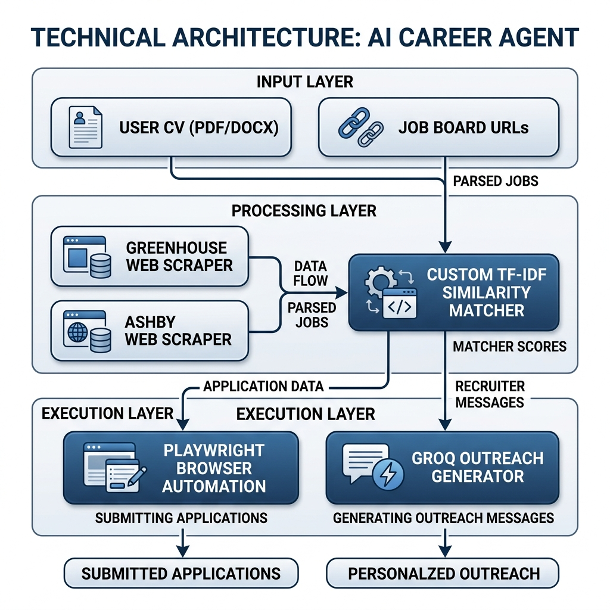
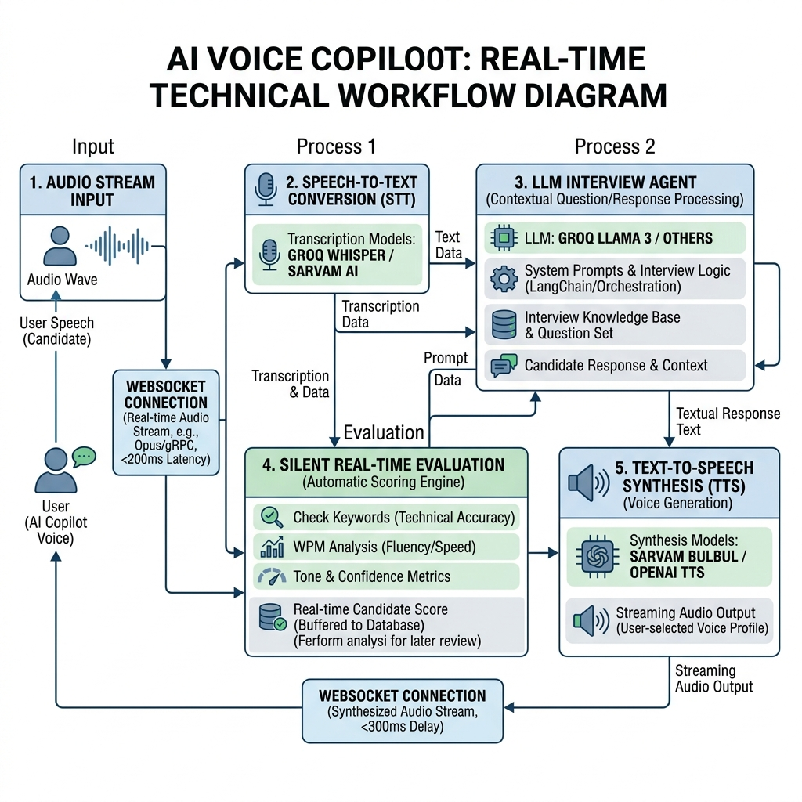
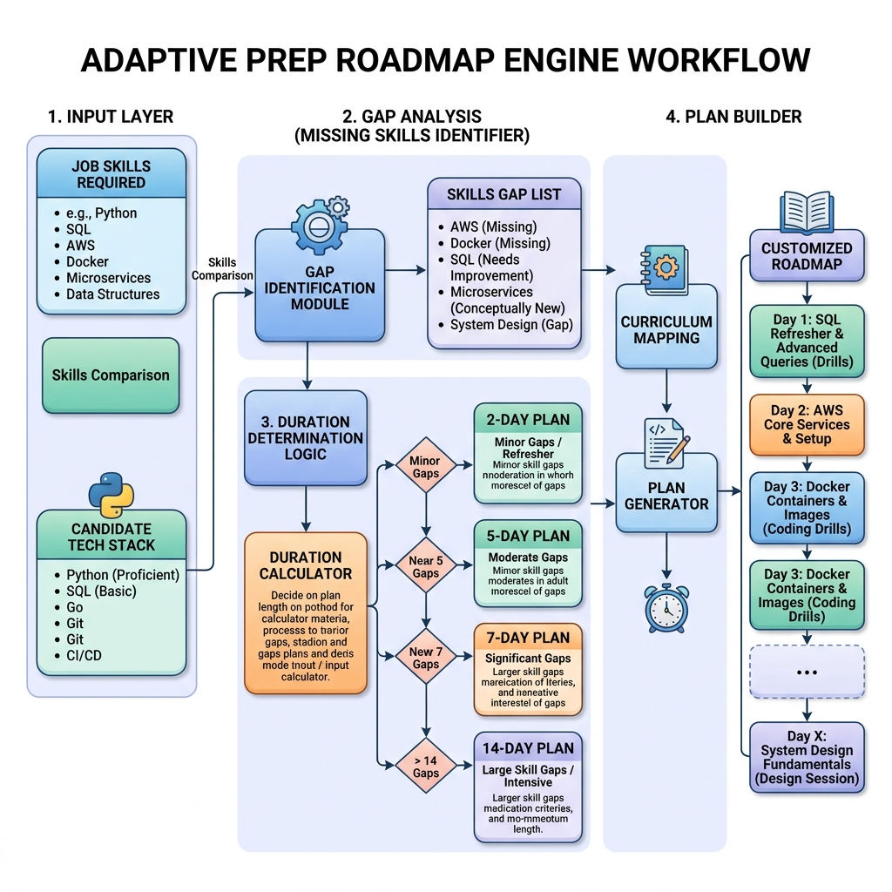
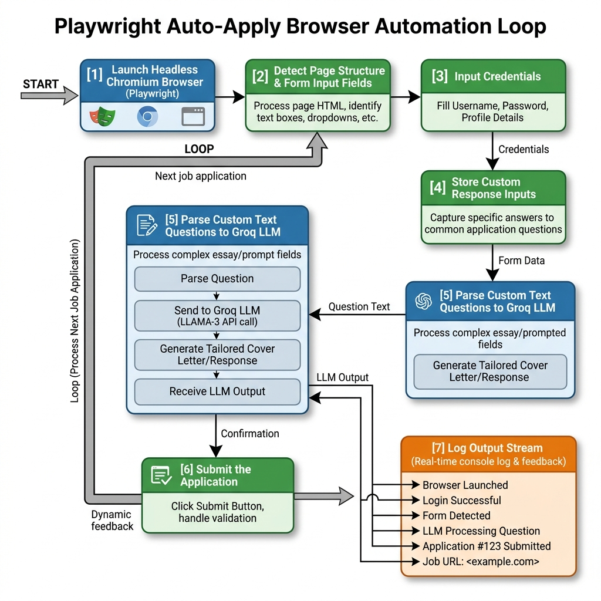
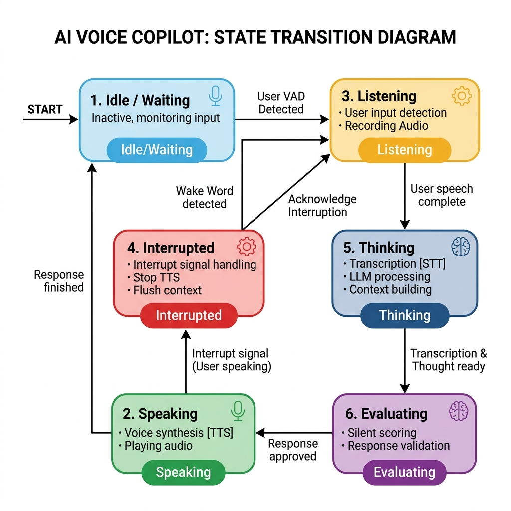
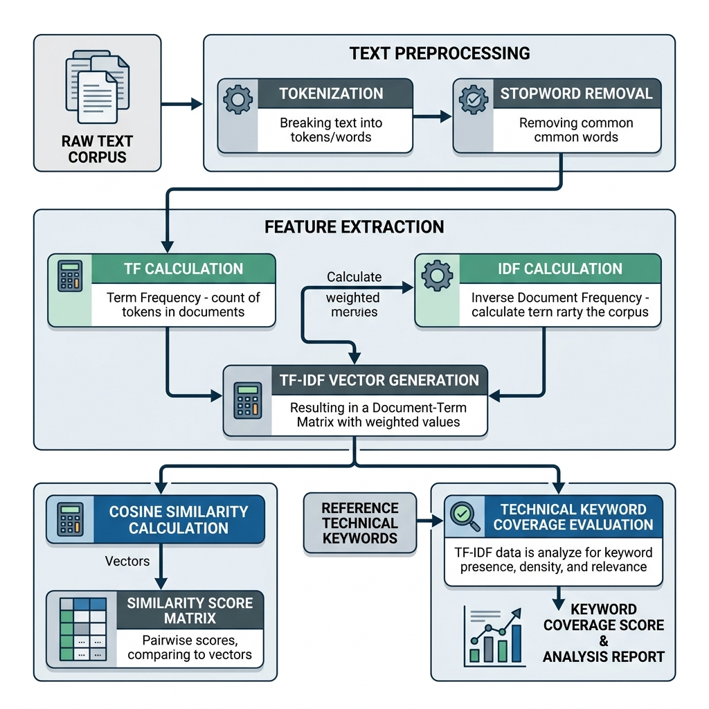
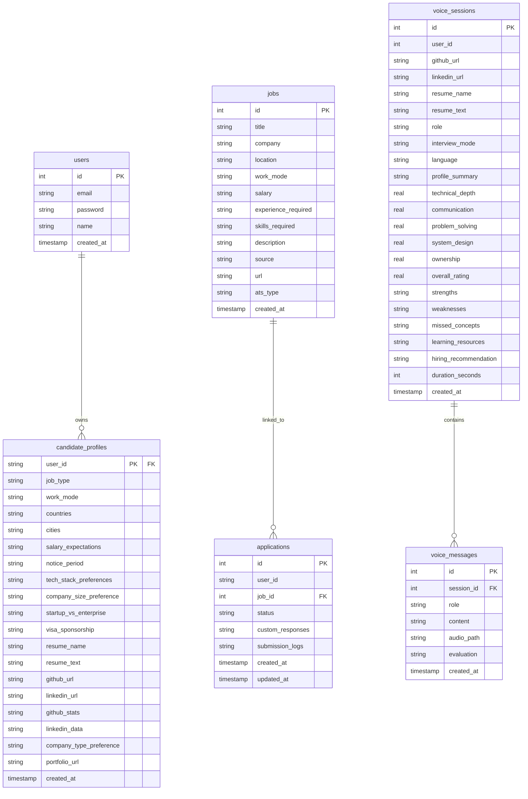

# PrepAI: AI-Powered Technical Interview Simulator and Career Co-Pilot

<p align="left">
  <a href="https://nextjs.org/"></a>
  <a href="https://fastapi.tiangolo.com/"></a>
  <a href="https://www.python.org/"></a>
  <a href="https://react.dev/"></a>
  <a href="https://playwright.dev/"></a>
  <a href="https://firebase.google.com/"></a>
  <a href="LICENSE"></a>
</p>

PrepAI is an advanced, enterprise-grade technical interview simulation and career management system. The platform analyzes candidate profiles, parses PDF resumes, scrapes target GitHub repositories, and coordinates stateful technical mock interviews across various seniority levels. Additionally, it features an automated job discovery matching engine, a prep roadmap planner, an AI-driven outreach sequence generator, and a browser automation auto-apply pipeline (Beta).

---

## System Architecture

PrepAI consists of two primary architectural systems coordinated by a FastAPI backend and displayed on a Next.js single-page application.

### 1. AI Career Agent

The AI Career Agent coordinates job matching, preparatory roadmaps, and human-in-the-loop application submissions. It operates via the following workflow:



1. **Information Extraction**: Candidate uploads a PDF resume and provides target career preferences. The system parses the document, extracting technical skills, programming languages, and projects.
2. **Background Web Scraping**: The system periodically crawls Greenhouse and Ashby job boards of leading technology companies, populating a unified Postgres jobs database.
3. **Similarity Engine**: Candidates are matched against scraped positions using a from-scratch Term Frequency-Inverse Document Frequency (TF-IDF) similarity vectorizer.
4. **Outreach & Applying**: The system generates tailored networking outreach packages (cold emails, LinkedIn connection requests, follow-ups) using large language models. The Playwright-based browser automation agent (Beta) can attempt to fill out job board application forms, solve simple questionnaires, and handle submissions (Note: this feature is experimental and may not work on all sites).

### 2. AI Voice Copilot

The AI Voice Copilot conducts stateful, real-time audio mock interviews. The speech processing pipeline and execution loop are structured as follows:



1. **Stateful Connection**: The frontend establishes a WebSocket connection with the backend, allowing bi-directional streaming of speech audio data and real-time state synchronization.
2. **Speech-to-Text (STT) Service**: User audio chunks are sent via WebSocket or REST, processed, and transcribed. The system utilizes Sarvam AI STT (optimized for Indian accents and code-mixed inputs) or Groq Whisper-large-v3, with an option to run local Faster-Whisper.
3. **Interview LLM Agent**: The transcript is forwarded to the InterviewAgent. Using candidate details (resume, LinkedIn profile, and active GitHub repository code snippets) and selected seniority persona instructions, the LLM generates the next single, conversational interview question.
4. **Text-to-Speech (TTS) Service**: The question text is synthesized into a natural-sounding audio stream using Sarvam bulbul:v3, OpenAI TTS, or local Kokoro TTS, and played back to the user.
5. **Real-time Evaluation Engine**: While the interview progresses, a silent evaluation thread checks user responses for technical keyword coverage, WPM, and filler words, updating candidate scoring logs dynamically.

---

## Detailed Feature Workflows and Modes

PrepAI utilizes specific logic paths and integration modes depending on the desired feature context.

### 1. Adaptive Preparation Roadmap Engine
The Preparation Roadmap Engine analyzes candidate skill coverages and constructs audit calendars to bridge identified technical gaps.



* **Gap Analysis Processing**: The backend extracts candidate skills from their resume and compares them with the required skills fetched from the job description.
* **Duration Selection Rule**:
  * **2-Day Plan (0 gaps)**: Focuses on quick syntax refreshers, mock reviews, and system concept overviews.
  * **5-Day Plan (1-2 gaps)**: Focuses on target skill deep-dives, small prototype builds, coding algorithm practice, and final checklists.
  * **7-Day Plan (3-4 gaps)**: Dedicates time to theoretical bridging, algorithmic drills (sliding windows, double pointers), target company profiling (engineering blogs), and mock reviews.
  * **14-Day Plan (>4 gaps)**: Standard roadmap focusing on prototype development, distributed system components (load balancers, message queues), advanced DSA (graphs, dynamic programming), and final polish simulations.
* **Mock Drill Generation**: Questions are categorized into Coding, System Design, and Behavioral challenges, tailored specifically to target company profiles.

### 2. Human-in-the-Loop Auto-Apply Engine [BETA]
> [!WARNING]
> The auto-apply browser automation engine is in **Beta**. Due to the dynamic nature of job board selectors, site protection mechanisms, and CAPTCHAs, this feature is experimental and may not work correctly on all external sites.

The browser automation pipeline handles job application submissions using Playwright.



* **Form Analysis Mode**: Playwright loads job boards in a headful Chromium session. It parses standard application layouts to detect fields (Name, Email, Resume Upload, GitHub/LinkedIn URLs).
* **LLM Cover Question Formulation**: When custom questions are detected (e.g. "Why do you want to join?"), the system forwards the candidate resume text, project metrics, and job details to Groq LLM running `qwen/qwen3.6-27b` (default). The model writes a professional, context-aware 2-3 sentence answer.
* **Interactive Verification Hook**: The candidate can review, modify, and confirm all filled credentials and generated answers on the Next.js frontend drawer before launching the submission action.

### 3. Voice Copilot Stateful Interactions and Seniority Modes
The AI Voice Copilot maintains a real-time conversational workflow using standard WebSocket streaming.



* **Real-time State Transitions**:
  * **Idle/Waiting**: System stands by for the session to initialize or user to begin speaking.
  * **Thinking**: Triggered when the user finishes speaking. The system transcribes user speech (STT) and runs the LLM Interview Agent to build the next response context.
  * **Speaking**: Synthesized audio is streamed back (TTS) and played to the candidate.
  * **Listening**: The frontend turns on the microphone, capturing candidate speech in audio chunks.
  * **Interrupted**: If the candidate speaks while the AI is talking, the frontend registers the sound wave threshold and fires an interrupt payload over WebSocket, halting the TTS audio playback instantly.
  * **Evaluating**: Concurrently, the candidate's answers are evaluated in a background thread to grade technical content, filler counts, and WPM rates.
* **Seniority Persona Profiles**:
  * **Junior**: Converses in a friendly, supportive tone. Focuses on coding syntax, fundamental programming logic, and provides detailed explanations when the candidate gets stuck.
  * **Mid-Level**: Focuses on API design patterns, testing libraries, databases, and standard modular software architectures.
  * **Senior**: Probes deeply into system design, indexing, caching policies, tradeoffs, performance profiling, and load balancing.
  * **Staff Engineer**: Asks about multi-region failovers, disaster recovery, long-term technical migrations, legacy refactoring, and multi-team engineering consensus.
  * **Bar Raiser (FAANG Mock)**: Implements a high-pressure technical screening. Directly challenges candidate design assumptions, probes edge cases (e.g. partition failures, consensus problems), and calls out vague or incomplete answers.

### 4. Responsive Mobile & Tablet Layout Optimization
PrepAI is fully optimized for fluid browsing on small screens, adapting complex dashboards, code reviews, and voice panels to mobile viewports.

* **Sliding Navigation Drawer**: Sidebars compress into sliding overlays on viewports smaller than `1024px` (`lg`), complete with a dismissible blur backdrop.
* **Auto-Wrapping Data Views**: Score tables and performance timelines dynamically shift into horizontal scrolling containers (`overflow-x-auto`) to prevent column clipping.
* **Responsive Forms**: Candidate details grids automatically shift from multi-column grids to single-column inputs on phone widths.

---

## Machine Learning Infrastructure and Data Processing

PrepAI implements custom, from-scratch Machine Learning models to govern text processing, similarity matching, and candidate response scoring, avoiding dependency on heavy external frameworks.

### Data Flow Diagram for Custom ML Engine



### 1. Term Frequency-Inverse Document Frequency (TF-IDF) Engine

The TF-IDF model, located in `backend/ml/tfidf/tfidf.py`, is built entirely from scratch. It mathematically evaluates the relevance of job postings to candidate resumes.

#### Stopword Filtration and Tokenization
Raw text is cleaned of punctuation, converted to lowercase, and split into individual word tokens. Grammatical noise (stop words such as "the", "and", "under") is removed using an internal vocabulary filter to retain only high-value semantic terms.

#### Term Frequency (TF) Calculation
The relative frequency of a term $t$ in a document $d$ is computed as:

$$\text{TF}(t, d) = \frac{\text{Frequency of } t \text{ in } d}{\text{Total number of terms in } d}$$

#### Inverse Document Frequency (IDF) Calculation
To ensure common words do not dominate the calculations, terms are weighted using Inverse Document Frequency. The model implements logarithmic smoothing to prevent division-by-zero errors when a term is not in the corpus:

$$\text{IDF}(t) = \ln\left(\frac{1 + N}{1 + \text{DF}(t)}\right) + 1$$

Where:
* $N$ is the total document count in the matching corpus.
* $\text{DF}(t)$ is the document frequency (the number of documents containing term $t$).

#### Cosine Similarity Score Computation
Documents are represented as multidimensional vectors in the term space. The cosine similarity between candidate resume vector $V_1$ and job description vector $V_2$ determines the matching alignment score:

$$\text{Similarity}(V_1, V_2) = \frac{V_1 \cdot V_2}{\|V_1\| \|V_2\|} = \frac{\sum_{i=1}^{n} V_{1i} V_{2i}}{\sqrt{\sum_{i=1}^{n} V_{1i}^2} \sqrt{\sum_{i=1}^{n} V_{2i}^2}}$$

The result sits in the range $[0.0, 1.0]$, representing the exact alignment of skills and technologies.

### 2. Live Interview Evaluation Model

The evaluation engine, located in `backend/ml/evaluation/evaluation.py`, assesses the verbal answers transcribed during the Voice Copilot sessions.

#### Process Sequence
1. **Keyword Extraction**: The system tokenizes the question and filters tokens against a specialized technical database containing standard engineering concepts (e.g. concurrency, caching, indexing). This constructs a set of expected keywords for the specific context.
2. **Answer Alignment Analysis**: The candidate's response is compared against the expected keywords. Additional positive technical concepts present in the answer are extracted and added to the score.
3. **Similarity Assessment**: The system runs a local TF-IDF similarity calculation between the question text and the candidate's answer to evaluate if the response remains conceptually aligned.
4. **Scoring Formulation**: The final rating is a weighted combination of cosine similarity (40%) and expected technical keyword coverage (60%):
   $$\text{Raw Score} = (0.4 \times \text{Similarity}) + (0.6 \times \text{Keyword Ratio})$$
   The raw score is mapped to a standard corporate grading scale $[1.0, 10.0]$:
   $$\text{Final Score} = \min(10.0, \max(1.0, \text{Raw Score} \times 10 + 3.5))$$
5. **Speech Metrics Analysis**:
   * **Filler Word Tracking**: Scans for verbal fillers ("um", "uh", "like", "actually", "basically", "so") to assess speech confidence.
   * **Words Per Minute (WPM)**: Monitors speech rate to flag overly slow or rapid speech patterns.
   * **Adaptive Feedback Selection**: Compares the score against threshold limits, dynamically returning constructive, live coaching tips (e.g., advising candidates to cover missing keywords or structure their examples).
6. **Codebase-Specific Question Generation**:
   The engine reads the candidate's GitHub repository structure, extracts real code snippets from files containing logic (e.g., python or javascript functions), identifies the candidate's skills from the resume, and dynamically formulates customized, codebase-specific interview questions.

---

## Database Schema and Persistence Layer

PrepAI utilizes Neon Postgres as its primary persistence layer. To prevent database access failures across the codebase, a wrapper layer in `backend/database.py` maps database rows to dictionary-style rows.

### Core Database Models



### PostgreSQL Migration Logic
The database initializer (`init_db`) executes checks using metadata tables (`information_schema.columns` and `information_schema.table_constraints`). Alterations are only applied if columns or constraints do not exist, ensuring schema updates execute safely without failing database initialization.

---

## Technology Stack

### Frontend
* **Core framework**: Next.js 16 (App Router, Turbopack)
* **User Interface**: React 19, Vanilla CSS
* **Icons & Visuals**: Lucide React
* **Authentication**: Firebase Authentication
* **State Management**: React State Hooks, WebSocket API

### Backend
* **API Framework**: FastAPI (Uvicorn web server)
* **Language**: Python 3
* **Database Driver**: Psycopg2 (Neon serverless PostgreSQL integration)
* **AI Orchestration**: Groq Client, GPT-OSS-120B, Qwen-3.6-27B
* **Speech Engine**: Sarvam AI API (saaras:v3, bulbul:v3), OpenAI API (tts-1), or local Faster-Whisper/Kokoro TTS libraries
* **Document Parsing**: PyPDF
* **Automation**: Playwright (Headless Chromium browser orchestration)

---

## Local Setup and Installation

### Prerequisites
* Python 3.9 or higher
* Node.js 18 or higher
* Neon Postgres account and database connection string

### 1. Backend Setup
1. Navigate to the backend directory:
   ```bash
   cd backend
   ```
2. Set up a Python virtual environment and activate it:
   ```bash
   python -m venv venv
   # Windows (PowerShell):
   .\venv\Scripts\activate
   # macOS/Linux:
   source venv/bin/activate
   ```
3. Install dependencies:
   ```bash
   pip install -r requirements.txt
   ```
4. Create a `.env` configuration file in the `backend/` directory:
   ```env
   DATABASE_URL=postgresql://<user>:<password>@<host>/<database>?sslmode=require
   GROQ_API_KEY=your_groq_api_key_here
   SARVAM_API_KEY=your_sarvam_api_key_here
   OPENAI_API_KEY=your_openai_api_key_here
   ```
5. Run database initialization and seed default developer jobs:
   ```bash
   python -c "import database; database.init_db()"
   ```
6. Start the FastAPI server on port 8001:
   ```bash
   uvicorn main:app --reload --port 8001
   ```

### 2. Frontend Setup
1. Navigate to the frontend directory:
   ```bash
   cd ../frontend
   ```
2. Install npm packages:
   ```bash
   npm install
   ```
3. Create a `.env.local` configuration file in the `frontend/` directory:
   ```env
   NEXT_PUBLIC_BACKEND_URL=http://localhost:8001
   ```
4. Start the Next.js development server:
   ```bash
   npm run dev
   ```
5. Open your browser and navigate to [http://localhost:3000](http://localhost:3000).

---

## Git and Security Policy

The root `.gitignore` file is pre-configured to ensure API keys, local databases, and temporary configuration files are excluded from remote version control:
* `backend/.env` (Backend credentials)
* `frontend/.env.local` (Local frontend configurations)
* Build artifacts (`.next/`, `__pycache__/`, `.open-next/`)
* Scraped database transaction logs

---

## Creators

PrepAI was designed and developed by:
* Apurve Karanwal
* Akshita Tomar
* Akash Tiwari

