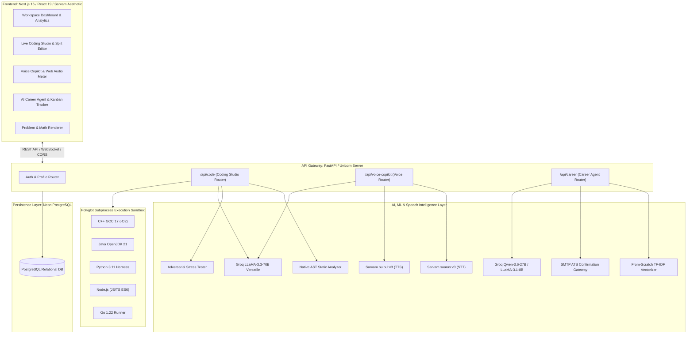
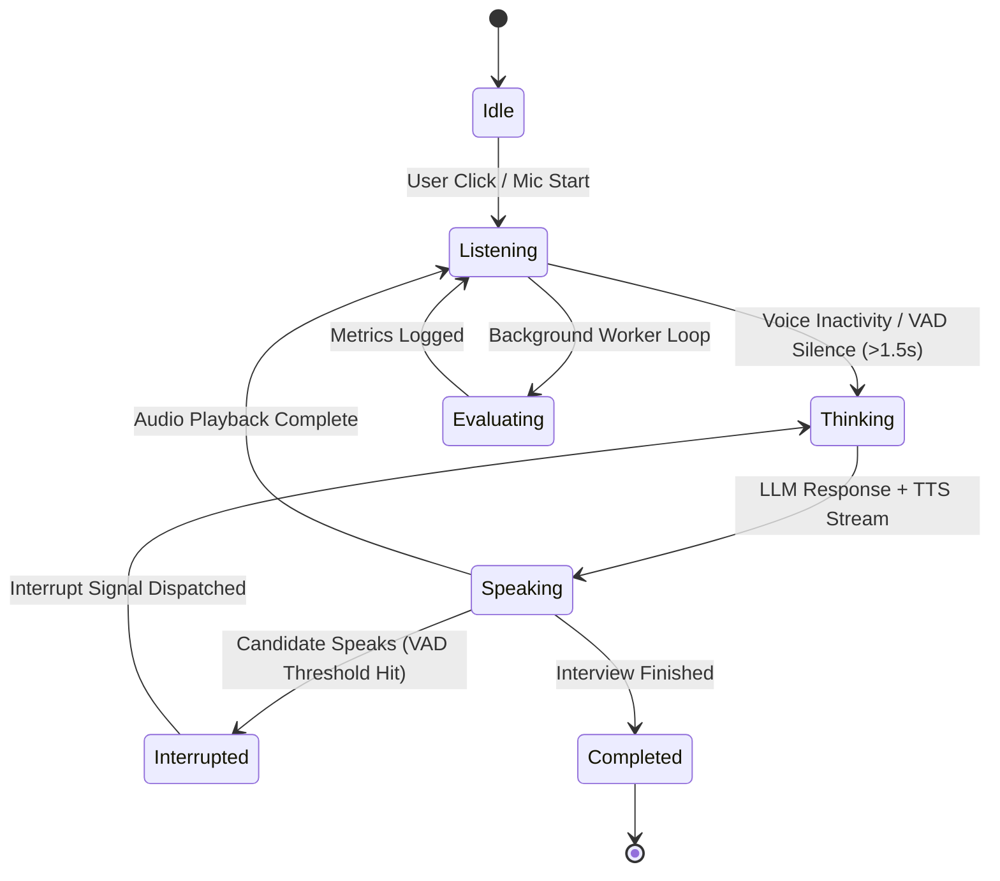
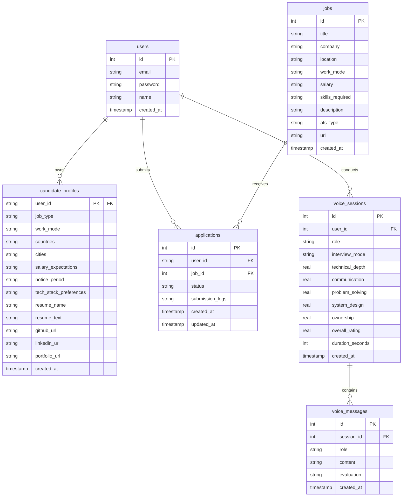

# PrepAI: AI-Powered Technical Interview Simulator, Live Polyglot Coding Studio & Career Co-Pilot

<p align="left">
  <a href="https://nextjs.org/"></a>
  <a href="https://fastapi.tiangolo.com/"></a>
  <a href="https://www.python.org/"></a>
  <a href="https://react.dev/"></a>
  <a href="https://gcc.gnu.org/"></a>
  <a href="https://www.oracle.com/java/"></a>
  <a href="https://nodejs.org/"></a>
  <a href="https://golang.org/"></a>
  <a href="https://groq.com/"></a>
  <a href="https://sarvam.ai/"></a>
  <a href="https://neon.tech/"></a>
  <a href="LICENSE"></a>
</p>

PrepAI is an enterprise-grade technical interview simulation, live polyglot coding studio, and career acceleration platform. Designed with an editorial, minimalist aesthetic inspired by **Sarvam.ai**, the system combines real-time conversational voice agents, isolated multi-language code execution sandboxes, adversarial stress testing suites, AST static complexity profilers, and autonomous ATS career pipelines.

---

## 📑 Table of Contents

1. [System Architecture & Data Flow](#-system-architecture--data-flow)
2. [Artificial Intelligence & Machine Learning Stack](#-artificial-intelligence--machine-learning-stack)
   - [Large Language Models & Fast Inference](#1-large-language-models--fast-inference-groq)
   - [Sarvam AI Neural Speech Pipeline](#2-sarvam-ai-neural-speech-pipeline-stt--tts)
   - [From-Scratch TF-IDF Matching Engine](#3-from-scratch-tf-idf-vectorizer--cosine-similarity)
   - [Real-Time Interview Evaluation Engine](#4-real-time-interview-evaluation-engine)
3. [Live Polyglot Coding Studio & Sandbox Engine](#-live-polyglot-coding-studio--sandbox-engine)
   - [Multi-Language Subprocess Runner](#1-multi-language-subprocess-sandbox)
   - [Problem Catalog Architecture (Stubs vs. Reference)](#2-problem-catalog-architecture-stubs-vs-reference-solutions)
   - [AST Eye Complexity Radar](#3-ast-eye-complexity-radar--static-profiler)
   - [Adversarial Chaos Stress Suite](#4-adversarial-chaos-stress-suite)
   - [Problem & LaTeX Typography Engine](#5-problem-markdown--latex-typography-engine)
4. [AI Voice Copilot & Technical Interviewer](#-ai-voice-copilot--technical-interviewer)
   - [State Machine & Web Audio VAD](#1-state-machine--web-audio-vad)
   - [Interviewer Personas & Seniority Levels](#2-interviewer-personas--seniority-levels)
5. [AI Career Agent & ATS Confirmation Engine](#-ai-career-agent--ats-confirmation-engine)
   - [High-Precision Resume Scraper](#1-high-precision-resume-entity-scraper)
   - [SMTP Confirmation & Official Tracking Receipts](#2-smtp-confirmation--official-tracking-receipts)
   - [Adaptive Preparation Roadmaps](#3-adaptive-preparation-roadmaps)
   - [Human-in-the-Loop Browser Automation](#4-human-in-the-loop-browser-automation-beta)
6. [Responsive Mobile & Tablet UI/UX](#-responsive-mobile--tablet-uiux)
7. [Database Schema & Persistence Layer](#-database-schema--persistence-layer)
8. [API Route Reference](#-api-route-reference)
9. [Local Setup & Development](#-local-setup--development)
10. [Production Deployment Guide (Vercel & Render)](#-production-deployment-guide-vercel--render)
11. [Contributors & License](#-contributors--license)

---

## 🏛️ System Architecture & Data Flow

PrepAI operates as a modern decoupled full-stack architecture. The frontend is built on **Next.js 16 (App Router with Turbopack)** deployed to Vercel, interfacing with a high-concurrency **FastAPI** backend service on Render connected to a serverless **Neon PostgreSQL** cluster.



---

## 🧠 Artificial Intelligence & Machine Learning Stack

### 1. Large Language Models & Fast Inference (Groq)

PrepAI utilizes a dual-tier model hierarchy orchestrated via the Groq high-speed LPU inference engine:

| Tier | Model Identifier | Primary Responsibilities |
| :--- | :--- | :--- |
| **Heavy Reasoning Engine** | `llama-3.3-70b-versatile` *(or `openai/gpt-oss-120b`)* | Complex AST code quality evaluation, algorithmic time/space proofing, Socratic interview generation, hiring committee scorecards, and tailored preparation roadmap synthesis. |
| **Low-Latency Agent Engine** | `llama-3.1-8b-instant` *(or `qwen/qwen3.6-27b`)* | Real-time conversational interview guidance, quick prompt hints, rapid resume entity parsing, and ATS cover answer formulation. |

### 2. Sarvam AI Neural Speech Pipeline (STT & TTS)

For ultra-low latency, natural voice interactions with Indian English accent optimization and multilingual support:
* **Speech-to-Text (`saaras:v3`)**: Transcribes 8kHz/16kHz PCM audio streams, handling domain-specific technical vocabulary, acronyms (e.g. `gRPC`, `Redis`, `K8s`, `AST`, `Big-O`), and code-mixed cadence.
* **Text-to-Speech (`bulbul:v3`)**: Synthesizes expressive, natural audio responses streamed back to the client over WebSocket or REST with configurable voice models and pace parameters.
* **Multi-Provider Fallbacks**: Configured with automatic graceful fallbacks to Groq Whisper-large-v3, OpenAI `tts-1`, or local Faster-Whisper / Kokoro TTS.

### 3. From-Scratch TF-IDF Vectorizer & Cosine Similarity

Located in `backend/ml/tfidf/tfidf.py`, this matching engine is written entirely from scratch without external dependencies (e.g., scikit-learn). It mathematically ranks job opportunities against parsed candidate resumes.

#### Mathematical Formulation

1. **Stopword Filtration & Tokenization**: Cleans punctuation, normalizes cases, and strips grammatical noise using an internal high-efficiency vocabulary filter.
2. **Term Frequency (TF)**:
   $$\text{TF}(t, d) = \frac{f_{t,d}}{\sum_{t' \in d} f_{t',d}}$$
   Where $f_{t,d}$ is the raw count of term $t$ in document $d$.
3. **Logarithmically Smoothed Inverse Document Frequency (IDF)**:
   $$\text{IDF}(t) = \ln\left(\frac{1 + N}{1 + \text{DF}(t)}\right) + 1$$
   Where $N$ is the total document count and $\text{DF}(t)$ is the count of documents containing term $t$.
4. **Vector Normalization & Cosine Similarity**:
   $$\text{Cosine Similarity}(V_{\text{resume}}, V_{\text{job}}) = \frac{V_{\text{resume}} \cdot V_{\text{job}}}{\|V_{\text{resume}}\| \|V_{\text{job}}\|} = \frac{\sum_{i=1}^n V_{1i} V_{2i}}{\sqrt{\sum_{i=1}^n V_{1i}^2} \sqrt{\sum_{i=1}^n V_{2i}^2}}$$

### 4. Real-Time Interview Evaluation Engine

Located in `backend/ml/evaluation/evaluation.py`, this evaluator scores spoken responses during Voice Copilot mock interviews:

* **Keyword Alignment Analysis**: Tokenizes questions, matches candidate transcripts against expected technical concept dictionaries, and computes dynamic keyword ratios.
* **Semantic Alignment Score**:
  $$\text{Raw Score} = 0.40 \times \text{Cosine Similarity} + 0.60 \times \text{Keyword Coverage Ratio}$$
  $$\text{Final Score} = \min\left(10.0, \max\left(1.0, \text{Raw Score} \times 10 + 3.5\right)\right)$$
* **Speech Cadence & Filler Tracking**: Scans for vocal hesitations (`"um"`, `"uh"`, `"like"`, `"basically"`, `"actually"`, `"so"`) and calculates Words Per Minute (WPM) to assess fluency and confidence.

---

## 💻 Live Polyglot Coding Studio & Sandbox Engine

The **Live Coding Studio** (`backend/code_studio/`) provides a full-featured online judge and real-world system architecture environment.


### 1. Multi-Language Subprocess Sandbox

Deterministic, isolated execution using temporary file harnesses, standard stream isolation, and execution timeouts (`timeout_seconds=5.0`):

```
┌────────────────────────────────────────────────────────────────────────────┐
│                    POLYGLOT SUBPROCESS EXECUTION PIPELINE                  │
├─────────────┬───────────────────────────┬──────────────────────────────────┤
│ Language    │ Compiler / Runtime        │ Execution Harness Strategy       │
├─────────────┼───────────────────────────┼──────────────────────────────────┤
│ C++         │ GCC 17 (g++ -O2 -std=c++17│ Dynamic test vector wrapper with │
│             │                           │ nanosecond std::chrono profiling │
├─────────────┼───────────────────────────┼──────────────────────────────────┤
│ Java        │ OpenJDK 21 (javac / java) │ Solution.java wrapper with deep  │
│             │                           │ array/object equality asserts    │
├─────────────┼───────────────────────────┼──────────────────────────────────┤
│ Python      │ Python 3.11               │ Isolated tempfile harness with   │
│             │                           │ formatted traceback capture      │
├─────────────┼───────────────────────────┼──────────────────────────────────┤
│ JavaScript  │ Node.js 20+ (ES6)         │ Sandbox context with deep object │
│ TypeScript  │ Node.js TS Runner         │ serialization and assertions     │
├─────────────┼───────────────────────────┼──────────────────────────────────┤
│ Go (Golang) │ Go 1.22                   │ Dynamic main.go package testing  │
│             │                           │ pointers, structs, and slices    │
└─────────────┴───────────────────────────┴──────────────────────────────────┘
```

### 2. Problem Catalog Architecture (Stubs vs. Reference Solutions)

Located in `backend/code_studio/catalog.py` (28+ curated challenges across **DSA**, **Backend Systems**, and **Bug Hunt & Refactoring**):

* **`starter_code`**: Populated in the candidate editor on initial problem load. Provides clean function signatures, parameter typing, and stubs (`pass`, `return 0;`, `return {};`, `// TODO: Implement`). Running code initially fails test cases, ensuring candidates write solutions.
* **`reference_solution`**: Preserved internal optimal implementation used by the LLM for Socratic invariant hints, AST radar comparisons, and automated benchmarking.
* **Bug Hunt Mode**: Injects genuine buggy code (e.g. concurrency race conditions, memory leaks in cache, off-by-one binary search, SQL injections) where initial tests fail until the candidate patches the flaw.

### 3. AST Eye Complexity Radar & Static Profiler

Located in `backend/code_studio/analyzer.py`:
* **AST Parsing**: Parses code into Python/JS Abstract Syntax Trees, extracting nested loop depths, recursive call chains, branch complexity, and space allocations.
* **Big-O Classification**: Delivers automated Time ($O(1)$, $O(\log N)$, $O(N)$, $O(N \log N)$, $O(N^2)$, $O(2^N)$) and Space complexity classifications with code quality scores ($0-100\%$) and optimization tips.

### 4. Adversarial Chaos Stress Suite

Located in `backend/code_studio/chaos.py`:
Submits candidate code against automated extreme production edge cases:
1. **Scale Explosions**: $N=10^5$ memory and execution time stress limits.
2. **Monotonic Bursts**: Strict ascending/descending arrays testing pivot selection and balance invariants.
3. **Boundary Zeros & Overflow**: Cross-zero cancellation, zero divisions, and integer maximums ($2^{31}-1$).
4. **Jagged Distributions**: Non-uniform nested collections and memory exhaustion checks.
* Outputs an **Adversarial Resilience Percentage** ($0-100\%$) and failure diagnoses.

### 5. Problem Markdown & LaTeX Typography Engine

Implemented in [`frontend/components/coding/ProblemRenderer.jsx`](frontend/components/coding/ProblemRenderer.jsx):
* Converts raw markdown, inline backticks (`` `variable` ``), bold markers, constraint subheadings, and LaTeX mathematical expressions ($O(1)$, $N=10^5$) into clean, styled UI components.
* Renders custom terracotta bullet constraint cards without external heavy dependencies.

---

## 🎙️ AI Voice Copilot & Technical Interviewer

The AI Voice Copilot conducts stateful, conversational mock technical interviews over WebSocket with sub-second audio latency.


### 1. State Machine & Web Audio VAD



* **Web Audio Decibel VAD**: Analyzes microphone FFT frequency data in real time, detecting candidate speech starts and pauses without requiring manual click-to-talk.
* **Instant Audio Interruption**: If the candidate speaks while the AI interviewer is talking, a WebSocket interrupt signal instantly pauses audio playback and shifts the agent back to active listening.

### 2. Interviewer Personas & Seniority Levels

* **Junior Engineer**: Encouraging tone; focuses on coding syntax, core algorithms, and step-by-step guidance.
* **Mid-Level Engineer**: Probes API contracts, database schema designs, testing strategies, and modular code patterns.
* **Senior Engineer**: Probes distributed system tradeoffs, caching invalidation, database indexing, and latency vs. throughput.
* **Staff Engineer / Bar Raiser**: High-pressure architectural screening; challenges assumptions, tests edge cases (split-brain, network partitions, consensus protocols), and evaluates cross-team leadership.

---

## 🤖 AI Career Agent & ATS Confirmation Engine

The AI Career Agent automates career tracking, job discovery, and application receipts.


### 1. High-Precision Resume Entity Scraper

Located in `backend/resume_parser.py`:
* Extracts text from uploaded PDF resumes using PyPDF.
* Applies multi-layer deterministic RFC-compliant regex patterns and heuristics to extract candidate **Email**, **Phone Number**, **Full Name**, **LinkedIn URL**, **GitHub URL**, and **Portfolio Website**.

### 2. SMTP Confirmation & Official Tracking Receipts

Located in `backend/email_service.py`:
* **Requisition Tracking Reference**: Automatically generates verified tracking IDs (`APP-COMPANY-XXXXXX`).
* **HTML Email Dispatch**: Dispatches responsive HTML application receipts to candidate emails via SMTP.
* **In-App Receipt Modal**: 1-click modal with tracking ID copy on every Kanban application card.

### 3. Adaptive Preparation Roadmaps

Analyzes resume skill coverage against job requirements and constructs targeted study plans:
* **2-Day Plan (0 gaps)**: Syntax refreshers, system design review, final checklists.
* **5-Day Plan (1-2 gaps)**: Target skill deep dives, prototype builds, algorithmic drills.
* **7-Day Plan (3-4 gaps)**: Theoretical bridging, distributed components, mock interviews.
* **14-Day Plan (>4 gaps)**: End-to-end prototype development, advanced DSA, and comprehensive mock reviews.

### 4. Human-in-the-Loop Browser Automation [Beta]

* Uses **Playwright Chromium** to navigate job boards (Greenhouse, Ashby, Lever).
* Auto-fills candidate credentials and uses `qwen/qwen3.6-27b` to draft context-aware answers to custom screening questions.
* Allows candidate review and approval in a drawer before launching the submission action.

---

## 📱 Responsive Mobile & Tablet UI/UX

PrepAI is built with a responsive layout optimized for smartphones (320px–480px), tablets (600px–1024px), and desktop viewports:

* **Live Coding Studio Segmented Switcher**:
  On viewports $< 1024\text{px}$, the IDE transitions from a side-by-side split screen to a 1-tap **Segmented Pane Switcher**:
  - `📖 Problem / Guidance`: Full problem statement, constraints, and AI Socratic interviewer.
  - `💻 Editor`: Full-screen code editor with line numbers, font sizing, and copy tools.
  - `⚡ Console & Tests`: Full-screen test runner, execution logs, and AST complexity radar.
* **Intelligent Auto-Pane Switching**:
  - Tapping **`Run Code`** automatically switches the mobile view to the **Console** tab with live test results.
  - Tapping **`Submit Solution`** or **`Stress Test`** switches to the **Problem** tab displaying the scorecard or chaos report.
* **Sliding Navigation Drawer**:
  - Desktop sidebar collapses into a sliding drawer on mobile with a blur backdrop.
  - Touch target sizes meet the 44px minimum standard for mobile ergonomics.

---

## 🗄️ Database Schema & Persistence Layer

PrepAI uses **Neon Serverless PostgreSQL** with an automated schema migration system (`backend/database.py`).



---

## 🌐 API Route Reference

### 1. Code Studio & Sandbox (`/api/code`)
| Method | Endpoint | Description |
| :--- | :--- | :--- |
| `GET` | `/api/code/problems` | Fetch all catalog problems (DSA, Backend, Bug Hunt) with starter stubs |
| `POST` | `/api/code/run` | Execute code against test suite in isolated subprocess sandbox |
| `POST` | `/api/code/ast-complexity` | Run static AST parsing and Big-O Time/Space complexity classification |
| `POST` | `/api/code/chaos-test` | Subject code to adversarial scale ($N=10^5$), monotonic, and boundary tests |
| `POST` | `/api/code/copilot-guidance`| Socratic hints, algorithm invariants, and conversational code assistance |
| `POST` | `/api/code/submit-evaluation` | Submit solution for hiring committee scorecard and evaluation |
| `POST` | `/api/code/generate-problem` | Dynamically generate new interview challenges tailored to candidate stack |

### 2. Voice Copilot (`/api/voice-copilot`)
| Method | Endpoint | Description |
| :--- | :--- | :--- |
| `WS` | `/api/voice-copilot/ws` | Bi-directional streaming WebSocket for speech audio, VAD, and interrupts |
| `POST` | `/api/voice-copilot/session/start` | Initialize stateful mock interview session with candidate profile |
| `POST` | `/api/voice-copilot/transcribe` | Transcribe audio stream (Sarvam STT `saaras:v3` / Groq Whisper) |
| `POST` | `/api/voice-copilot/synthesize` | Synthesize interviewer speech audio (Sarvam TTS `bulbul:v3`) |
| `POST` | `/api/voice-copilot/session/end` | Finalize session and generate multi-dimensional score rating |

### 3. Career Agent (`/api/career`)
| Method | Endpoint | Description |
| :--- | :--- | :--- |
| `GET` | `/api/career/profile` | Retrieve candidate intelligence profile and preferences |
| `POST` | `/api/career/onboard` | Upload resume PDF, parse entities, and save career preferences |
| `GET` | `/api/career/jobs` | Retrieve matched job postings ranked by TF-IDF cosine similarity |
| `POST` | `/api/career/apply/prepare` | Extract form fields and draft custom AI screening answers |
| `POST` | `/api/career/apply/submit` | Launch auto-apply browser agent and dispatch email confirmation receipt |
| `GET` | `/api/career/receipt/{job_id}`| Retrieve verified ATS confirmation receipt and tracking reference |
| `GET` | `/api/career/applications` | Retrieve candidate application pipeline and metrics |
| `PATCH`| `/api/career/applications/{id}`| Update Kanban status (`Applied`, `OA Received`, `Interview`, `Offer`) |
| `POST` | `/api/career/roadmap` | Generate adaptive 2-day to 14-day gap-bridging preparation calendar |

---

## 🚀 Local Setup & Development

### Prerequisites
* **Node.js**: v18.0 or higher
* **Python**: v3.11 or higher
* **Compilers (for native polyglot sandbox)**:
  - C++: `g++` (GCC 17+ or MinGW)
  - Java: OpenJDK 21
  - Go: Go 1.22+
* **Database**: Neon Serverless PostgreSQL (or local PostgreSQL instance)

### 1. Clone Repository
```bash
git clone https://github.com/ApurveKaranwal/PrepAI.git
cd PrepAI
```

### 2. Backend Setup
```bash
cd backend
python -m venv venv

# Windows (PowerShell):
.\venv\Scripts\activate
# macOS / Linux:
source venv/bin/activate

pip install -r requirements.txt
```

Create `backend/.env`:
```env
DATABASE_URL=postgresql://<user>:<password>@<host>/<database>?sslmode=require
GROQ_API_KEY=your_groq_api_key
SARVAM_API_KEY=your_sarvam_api_key

# Optional: Outbound SMTP Receipts
SMTP_HOST=smtp.gmail.com
SMTP_PORT=587
SMTP_USER=your_email@gmail.com
SMTP_PASSWORD=your_app_password
```

Initialize database & seed catalog:
```bash
python -c "import database; database.init_db()"
```

Start the FastAPI backend server:
```bash
uvicorn main:app --reload --port 8001
```

### 3. Frontend Setup
```bash
cd ../frontend
npm install
```

Create `frontend/.env.local`:
```env
NEXT_PUBLIC_BACKEND_URL=http://localhost:8001
```

Start the Next.js development server:
```bash
npm run dev
```
Open [http://localhost:3000](http://localhost:3000) in your browser.

---

## 🌐 Production Deployment Guide (Vercel & Render)

### 1. Deploying Frontend on Vercel
1. Import repository on [Vercel](https://vercel.com).
2. Set **Root Directory** to `frontend`.
3. Set **Framework Preset** to `Next.js`.
4. Configure Environment Variables:
   - `NEXT_PUBLIC_BACKEND_URL`: `https://<your-render-service>.onrender.com` *(no trailing slash)*
5. Deploy!

### 2. Deploying Backend on Render
1. Create a new **Web Service** on [Render](https://render.com) from the repository.
2. Set **Root Directory** to `backend`.
3. Set **Environment** to `Python 3`.
4. Set **Build Command** to:
   ```bash
   pip install -r requirements.txt
   ```
5. Set **Start Command** to:
   ```bash
   uvicorn main:app --host 0.0.0.0 --port $PORT
   ```
6. Add Environment Variables:
   - `DATABASE_URL`: Your PostgreSQL connection string.
   - `GROQ_API_KEY`: Your Groq API key.
   - `SARVAM_API_KEY`: Your Sarvam API key.
7. Deploy!

---

## 👥 Contributors

PrepAI was designed and developed by:
* **Apurve Karanwal** ([GitHub](https://github.com/ApurveKaranwal))
* **Akshita Tomar**
* **Akash Tiwari**

---

## 📄 License

This project is licensed under the [MIT License](LICENSE).
